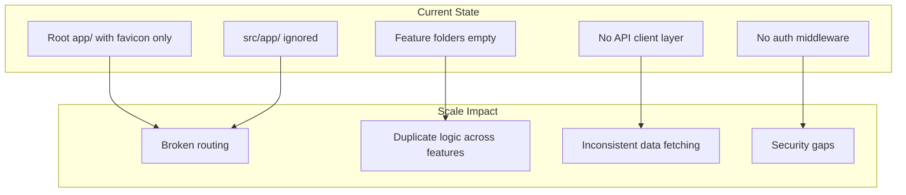

# Bitcraftly Platform — Project Foundation Review

**Reviewer role:** Principal Frontend Architect  
**Review date:** July 11, 2026  
**Repository:** `bitcraftly-platform`  
**Scope:** Folder structure, Next.js/TypeScript/Tailwind configuration, existing files, documentation, and project rules. No code changes were made as part of this audit.

---

## Executive Summary

The repository is an early-stage Next.js 16 scaffold with **good architectural intent** but **critical structural inconsistency** in its current working tree. A migration from root `app/` to `src/app/` was started locally but is incomplete and **currently breaks routing**.

| Area | Status | Severity |
|------|--------|----------|
| App Router resolution | Broken (home route missing) | **Critical** |
| `src/` feature scaffold | Planned, not integrated | High |
| TypeScript strict mode | Enabled | Good |
| Tailwind CSS v4 | Correct baseline setup | Good |
| Documentation | Placeholder / boilerplate | High |
| CI, testing, env tooling | Missing | High |
| Git hygiene | Uncommitted structural work | Medium |

**Bottom line:** Before feature development, resolve the dual `app/` vs `src/app/` conflict, commit the intended foundation, and replace boilerplate documentation with Bitcraftly-specific guidance.

## AI Development Foundation

This project uses:

- AGENTS.md
- PROJECT_CONTEXT.md
- CLAUDE.md
- Cursor Rules

AI workflow:

PROJECT_CONTEXT.md
        ↓
Relevant Rules
        ↓
Feature Development
        ↓
Code Review

## Current Architecture Status

Architecture: Stable

App Router: Stable

Feature Architecture: Stable

Design System: In Progress

Authentication: Planned

AI Integration: Planned

Documentation: Enterprise

## Current Architecture Status

Architecture: Stable

App Router: Stable

Feature Architecture: Stable

Design System: In Progress

Authentication: Planned

AI Integration: Planned

Documentation: Enterprise

## AI Rules

Always

Engineering

Architecture

Accessibility

When Needed

Performance

SEO

Code Review

Foundation

↓

Design System

↓

Authentication

↓

Dashboard

↓

CRM

↓

CMS

↓

AI

↓

Production

↓

Scaling

---

## 1. Folder Structure

### Current layout (working tree)

```
bitcraftly-platform/
├── .cursor/rules/          # Engineering standards (untracked)
├── app/                      # Root App Router — ONLY favicon.ico remains
│   └── favicon.ico
├── docs/                     # Doc placeholders (untracked)
│   ├── api/
│   ├── architecture/
│   ├── database/
│   ├── decisions/
│   ├── design/
│   └── prompts/
├── public/                   # Default create-next-app assets
├── src/                      # Intended application root (untracked)
│   ├── app/
│   │   ├── layout.tsx
│   │   └── page.tsx
│   ├── components/
│   │   ├── common/
│   │   ├── layout/
│   │   ├── marketing/
│   │   ├── providers/
│   │   └── ui/
│   ├── config/
│   ├── data/
│   ├── features/
│   │   ├── ai/
│   │   ├── auth/
│   │   ├── cms/
│   │   ├── crm/
│   │   ├── dashboard/
│   │   └── homepage/
│   ├── hooks/
│   ├── lib/
│   ├── services/
│   ├── styles/
│   │   └── globals.css
│   ├── types/
│   └── utils/
├── AGENTS.md
├── CLAUDE.md
├── README.md
├── next.config.ts
├── tsconfig.json
├── postcss.config.mjs
├── eslint.config.mjs
└── package.json
```

### Committed layout (git `HEAD`)

The last commit (`a11aeaa — chore: initialize Bitcraftly platform`) contains the default **root `app/`** structure:

- `app/layout.tsx`, `app/page.tsx`, `app/globals.css`, `app/favicon.ico`
- `tsconfig.json` path alias: `@/*` → `./*`
- No `src/`, no `docs/`, no `.cursor/`

### Critical issue: incomplete `src/` migration

Next.js resolves App Router in this order:

1. If `app/` exists at the project root → use root `app/`
2. Else if `src/app/` exists → use `src/app/`

Because root `app/` still exists (with `favicon.ico`), **`src/app/` is completely ignored**.

**Evidence:** Production build output shows only:

```
Route (app)
─ ○ /_not-found
```

No `/` route is registered. The application home page in `src/app/page.tsx` is never compiled.

**Local git state confirms the mismatch:**

| Path | Git status |
|------|------------|
| `app/layout.tsx`, `app/page.tsx`, `app/globals.css` | Deleted (unstaged) |
| `src/` | Untracked |
| `tsconfig.json` | Modified (`@/*` → `./src/*`) |
| `docs/`, `.cursor/` | Untracked |

This is the single highest-priority fix before any other foundation work.

### Planned structure assessment

The `src/` scaffold aligns with the stated **feature-based architecture** in `.cursor/rules/Bitcraftly-Engineering-Standards.mdc`:

| Directory | Intended role | Current state |
|-----------|---------------|---------------|
| `src/features/*` | Domain modules (auth, crm, cms, ai, dashboard, homepage) | Empty (`.gitkeep` only) |
| `src/components/ui` | Shared design-system primitives | Empty |
| `src/components/layout` | Shell, nav, sidebar | Empty |
| `src/components/providers` | Context / client providers | Empty |
| `src/services/` | API / external integrations | Empty |
| `src/lib/` | Framework adapters, shared clients | Empty |
| `src/utils/` | Pure helpers | Empty |
| `src/data/` | Static / seed data | Empty |
| `src/hooks/` | Shared React hooks | Empty |
| `src/types/` | Shared TypeScript types | Empty |
| `src/config/` | App configuration | Empty |

The scaffold is reasonable for an enterprise platform, but **boundaries between `lib/`, `services/`, `utils/`, and `data/` are undefined**, which will cause drift as the team grows.

### Missing folders (recommended)

| Folder / file | Why it matters |
|---------------|----------------|
| `src/middleware.ts` | JWT auth, route protection, redirects (referenced in engineering standards) |
| `src/app/(marketing)/`, `src/app/(dashboard)/` | Route groups for layout separation at scale |
| `src/app/api/` or external API client layer | FastAPI integration boundary |
| `tests/` or `__tests__/` | Unit / integration tests |
| `e2e/` | End-to-end tests (Playwright) |
| `.github/workflows/` | CI (lint, typecheck, build, test) |
| `.env.example` | Documented environment contract |
| `docs/decisions/0001-*.md` | First ADR (e.g. adopt `src/` directory) |

### Unnecessary or problematic files

| Item | Recommendation |
|------|----------------|
| Root `app/` (after migration) | Remove entirely once `src/app/` is canonical; move `favicon.ico` to `src/app/` |
| `public/next.svg`, `public/vercel.svg` | Remove when replacing boilerplate homepage |
| 18+ `.gitkeep` files | Acceptable short-term; replace with README stubs per folder or first real file |
| Duplicate YAML frontmatter in `AGENTS.md` | Consolidate to a single frontmatter block |
| `.next/` build output (untracked) | Already in `.gitignore` — ensure it stays ignored |

---

## 2. Next.js Configuration

**File:** `next.config.ts`

```typescript
const nextConfig: NextConfig = {
  /* config options here */
};
```

### Current state

- Next.js **16.2.10** with Turbopack (default in dev)
- App Router (intended)
- Empty configuration object

### Issues observed

1. **Turbopack root warning** during build:
   > Detected multiple lockfiles… selected `C:\main\real_projects\package-lock.json`

   A parent-directory lockfile causes Next.js to infer the wrong workspace root. This can affect module resolution and caching in monorepo-adjacent setups.

2. **No production hardening:**
   - No `images.remotePatterns` for external assets
   - No security headers
   - No redirects/rewrites for auth flows
   - No `turbopack.root` to silence/fix workspace root inference

3. **No explicit `srcDir` concern** — Next.js auto-detects; the problem is the conflicting root `app/` directory, not config.

### Recommendations

- Set `turbopack.root` (or reorganize lockfiles) to pin the project root
- Add security headers before production deployment
- Document FastAPI proxy/rewrite strategy if frontend and backend are co-deployed
- Consider `experimental` or framework-specific options only after reading `node_modules/next/dist/docs/` (per `AGENTS.md` guidance for Next.js 16)

---

## 3. TypeScript Configuration

**File:** `tsconfig.json`

### Strengths

| Option | Value | Assessment |
|--------|-------|------------|
| `strict` | `true` | Correct for enterprise codebase |
| `noEmit` | `true` | Standard for Next.js |
| `moduleResolution` | `bundler` | Correct for Next 16 |
| `jsx` | `react-jsx` | Correct for React 19 |
| `paths` | `@/*` → `./src/*` (local) | Correct **after** migration completes |

### Gaps and risks

| Issue | Detail |
|-------|--------|
| Path alias / filesystem mismatch | Alias points to `src/*` but App Router still reads root `app/` |
| `allowJs: true` | Unnecessary if the project is TypeScript-only |
| `target: ES2017` | Conservative; consider `ES2022` for modern syntax support |
| No `baseUrl` | Works with `paths`, but explicit `baseUrl: "."` improves clarity |
| No `noUncheckedIndexedAccess` | Optional stricter flag for safer object access |
| No dedicated `typecheck` script | Build runs TS check, but CI should run it explicitly |

### Missing TypeScript tooling

- No path mapping for test files
- No shared `types/env.d.ts` for environment variables
- No runtime env validation library (e.g. `@t3-oss/env-nextjs` + Zod)

---

## 4. Tailwind CSS Setup

### Configuration files

| File | Role | Status |
|------|------|--------|
| `postcss.config.mjs` | `@tailwindcss/postcss` plugin | Correct (Tailwind v4) |
| `src/styles/globals.css` | `@import "tailwindcss"` + `@theme inline` | Correct pattern |
| `tailwind.config.js` | N/A | Not needed in v4 CSS-first mode |

### Theme tokens (current)

```css
:root {
  --background: #ffffff;
  --foreground: #171717;
}

@theme inline {
  --color-background: var(--background);
  --color-foreground: var(--foreground);
  --font-sans: var(--font-geist-sans);
  --font-mono: var(--font-geist-mono);
}
```

### Issues

1. **Design system gap:** Engineering standards require following the "Bitcraftly Design System" and prohibit hardcoded colors, but:
   - Only two semantic tokens exist (`background`, `foreground`)
   - `src/app/page.tsx` uses raw Tailwind palette classes (`bg-zinc-50`, `text-black`, `dark:bg-black`) and hardcoded hex in hover states (`#383838`, `#ccc`, `#1a1a1a`)
   - `docs/design/README.md` is a one-line placeholder

2. **Dark mode strategy:** Uses `prefers-color-scheme` media query only — no explicit theme toggle or `class`-based dark mode strategy documented.

3. **No component library:** `src/components/ui/` is empty. No shadcn/ui, Radix, or internal primitives.

4. **Styles not loaded in production path:** Because root `app/layout.tsx` is deleted locally and `src/app/layout.tsx` is ignored, Tailwind styles from `src/styles/globals.css` are not applied to any route.

### Recommendations

- Define full design tokens in `@theme` (colors, spacing scale, radii, shadows, typography)
- Document token naming in `docs/design/`
- Add a `ThemeProvider` in `src/components/providers/`
- Enforce token usage via ESLint or code review checklist

---

## 5. Existing Files Review

### Application code

| File | Status |
|------|--------|
| `src/app/layout.tsx` | Branded metadata ("Bitcraftly Platform"), imports `@/styles/globals.css` — **good intent, not active** |
| `src/app/page.tsx` | create-next-app boilerplate — needs replacement |
| `src/styles/globals.css` | Minimal Tailwind v4 theme — needs design system expansion |

### Configuration

| File | Status |
|------|--------|
| `package.json` | Minimal scripts; no test, format, or typecheck commands |
| `eslint.config.mjs` | Flat config with `eslint-config-next` core-web-vitals + typescript — adequate baseline |
| `.gitignore` | Standard; ignores `.env*`, `.next/`, and `next-env.d.ts` |

### Public assets

Default create-next-app SVGs (`next.svg`, `vercel.svg`, `file.svg`, `globe.svg`, `window.svg`). Appropriate to remove once custom branding exists.

### Dependencies

**Runtime:** `next@16.2.10`, `react@19.2.4`, `react-dom@19.2.4`  
**Dev:** Tailwind v4, ESLint 9, TypeScript 5

**Notable absences for stated stack (FastAPI + JWT + PostgreSQL):**

- HTTP client (e.g. `ky`, native `fetch` wrapper)
- Auth library or JWT handling utilities
- Form validation (e.g. `react-hook-form`, `zod`)
- State management (if needed beyond server components)
- Testing libraries
- Prettier / formatting
- Commit hooks (Husky, lint-staged)

---

## 6. README Review

**File:** `README.md`

### Current content

Standard create-next-app boilerplate:

- Generic "Getting Started" with `npm run dev`
- Points to editing `app/page.tsx` (incorrect after `src/` migration)
- Vercel deployment section
- No mention of Bitcraftly, architecture, backend, or environment setup

### Required updates (documentation-only)

- Project purpose and scope
- Prerequisites (Node version, env vars, FastAPI backend)
- Correct entry path (`src/app/page.tsx`)
- Folder structure overview
- Link to `docs/architecture/`
- Scripts reference (`dev`, `build`, `lint`, future `test`)
- Contribution / commit convention (Conventional Commits — already in engineering standards)

---

## 7. AGENTS.md Review

**File:** `AGENTS.md`

### Content

Contains a single actionable rule block:

> This is NOT the Next.js you know — read `node_modules/next/dist/docs/` before writing code.

This is **valuable** for Next.js 16, which has breaking changes from training-data conventions.

### Issues

1. **Duplicate YAML frontmatter** — two identical `---` blocks with `alwaysApply: true` (likely accidental duplication during editing)
2. **Scope too narrow** — does not reference Bitcraftly engineering standards, feature architecture, or backend integration
3. **No link to `.cursor/rules/`** — agents in Cursor get standards from the rule file, but AGENTS.md itself is minimal

### Recommendation

Merge into a single frontmatter block and add pointers to:

- `.cursor/rules/Bitcraftly-Engineering-Standards.mdc`
- `docs/architecture/`
- Next.js 16 local docs path

---

## 8. CLAUDE.md Review

**File:** `CLAUDE.md`

### Content

```markdown
---
description: 
alwaysApply: true
---

@AGENTS.md
```

### Assessment

- Thin wrapper that delegates to `AGENTS.md` — acceptable DRY pattern for Claude Code
- Empty `description` field reduces discoverability in tooling
- Inherits duplicate frontmatter issue from `AGENTS.md` indirectly

### Recommendation

Add a meaningful `description` (e.g. "Bitcraftly Platform agent instructions") and optionally `@`-reference engineering standards directly.

---

## 9. Project Rules Review

**File:** `.cursor/rules/Bitcraftly-Engineering-Standards.mdc`

### Strengths

Comprehensive and appropriate for an enterprise frontend:

- Clear tech stack declaration (Next 16, React 19, Tailwind v4, FastAPI, PostgreSQL, JWT)
- Feature-based architecture mandate
- Server Components first
- Strict TypeScript (`never use any`)
- Design system adherence
- Accessibility and performance guidelines
- Conventional Commits
- "Smallest safe change" workflow

### Gaps vs. actual codebase

| Rule | Reality |
|------|---------|
| Feature-based architecture | Scaffold exists; zero feature code |
| Follow Bitcraftly Design System | No design system documented or implemented |
| Never hardcode colors | Boilerplate page violates this |
| JWT Authentication | No auth infrastructure |
| Prefer Server Components | Boilerplate page is a Server Component (good) but uses client-heavy patterns soon needed for interactivity |

### Rule file status

- **Untracked in git** — standards exist only locally; teammates and CI cannot enforce them until committed

---

## 10. Documentation (`docs/`)

All subdirectories contain single-line placeholder READMEs:

| Path | Content quality |
|------|-----------------|
| `docs/architecture/` | One sentence |
| `docs/api/` | One sentence |
| `docs/design/` | One sentence |
| `docs/database/` | One sentence |
| `docs/decisions/` | ADR format described, no ADRs written |
| `docs/prompts/` | One sentence |

The `docs/decisions/` README correctly suggests `0001-adopt-src-directory.md` — this ADR should be the **first document written** to record the migration decision.

---

## 11. Scalability & Architecture Assessment

### What works

- Modern stack (Next 16, React 19, Tailwind 4, TS strict)
- Feature folder naming matches product domains (auth, crm, cms, ai, dashboard)
- Separation of UI layers (`components/ui`, `components/layout`, `components/providers`)
- Docs directory structure anticipates cross-cutting concerns

### Risks at scale



| Risk | Description | Mitigation |
|------|-------------|------------|
| **Split-brain architecture** | Root vs `src/` ambiguity | Complete migration; one App Router root |
| **Feature boundary erosion** | No colocation convention | Document: each feature owns `components/`, `hooks/`, `services/`, `types/` |
| **Shared vs feature code drift** | Three helper directories | Define: `lib` = infra, `services` = API calls, `utils` = pure functions |
| **Auth not foundational** | JWT mentioned but not scaffolded | Add middleware, session/token utilities, protected route groups early |
| **No API contract layer** | FastAPI backend with no client typing | OpenAPI → generated types, or shared Zod schemas |
| **No testing pyramid** | Zero tests | Add Vitest + RTL for units, Playwright for critical flows |
| **Boilerplate homepage** | Default Next.js marketing page | Replace with Bitcraftly homepage feature module |
| **Env config sprawl** | `.env*` gitignored, no example | Add `.env.example` with `NEXT_PUBLIC_API_URL`, etc. |

### Recommended target architecture

```
src/
├── app/                          # Routing only — thin pages
│   ├── (marketing)/
│   ├── (auth)/
│   └── (platform)/
│       └── dashboard/
├── features/
│   └── [feature]/
│       ├── components/
│       ├── hooks/
│       ├── services/
│       ├── types/
│       └── index.ts              # Public API of the feature
├── components/
│   ├── ui/                       # Design system primitives
│   └── layout/                   # App shell
├── lib/
│   ├── api/                      # Fetch client, error handling
│   └── auth/                     # Token refresh, session
├── middleware.ts
└── styles/
    └── globals.css               # Design tokens
```

---

## 12. Missing Configurations Checklist

| Config / tooling | Present | Priority |
|------------------|---------|----------|
| `next.config.ts` (production settings) | Empty | High |
| `tsconfig.json` strict mode | Yes | — |
| Tailwind v4 PostCSS | Yes | — |
| ESLint | Yes | — |
| Prettier | No | Medium |
| `.env.example` | No | High |
| `middleware.ts` | No | High |
| Unit tests (Vitest/Jest) | No | High |
| E2E tests (Playwright) | No | Medium |
| CI workflow | No | High |
| Husky / lint-staged | No | Medium |
| Dependabot / Renovate | No | Low |
| `components.json` (if shadcn) | No | Medium |
| OpenAPI / API types | No | High |
| ADRs | No | Medium |
| Design tokens doc | No | High |

---

## 13. npm Scripts Assessment

**Current:**

```json
{
  "dev": "next dev",
  "build": "next build",
  "start": "next start",
  "lint": "eslint"
}
```

**Recommended additions:**

| Script | Purpose |
|--------|---------|
| `typecheck` | `tsc --noEmit` |
| `lint:fix` | `eslint --fix` |
| `format` | Prettier |
| `test` | Unit tests |
| `test:e2e` | Playwright |
| `validate` | `typecheck && lint && test && build` |

---

## 14. Priority Action Plan

Ordered by dependency and impact. **No code is included — this is guidance only.**

### P0 — Unblock the application

1. **Resolve App Router conflict**
   - Option A (recommended): Delete root `app/` entirely; move `favicon.ico` to `src/app/favicon.ico`
   - Option B: Abandon `src/app/` and restore root `app/` (reverts migration intent)
2. **Verify** `npm run build` registers `/` route
3. **Commit** `src/`, `docs/`, `.cursor/` with a clear conventional commit

### P1 — Foundation documentation

4. Write ADR `0001-adopt-src-directory.md`
5. Replace `README.md` with Bitcraftly-specific onboarding
6. Expand `docs/design/` with initial design tokens
7. Fix duplicate frontmatter in `AGENTS.md`

### P2 — Developer experience

8. Add `.env.example`
9. Add `typecheck` script and GitHub Actions CI (lint + typecheck + build)
10. Configure `turbopack.root` in `next.config.ts`
11. Add Prettier + format script

### P3 — Platform readiness

12. Scaffold `src/lib/api/` for FastAPI integration
13. Add `src/middleware.ts` for auth route protection
14. Replace boilerplate homepage with `src/features/homepage/`
15. Add Vitest + first component test
16. Define feature colocation conventions in `docs/architecture/`

---

## 15. Verification Performed

The following commands were run during this audit:

| Command | Result |
|---------|--------|
| `npm run build` | Succeeds, but **only `/_not-found` route** — confirms routing break |
| `npm run lint` | Passes (no lintable application issues in active routes) |
| `git status` | Shows deleted root app files, untracked `src/` and docs |
| `git ls-files` | Confirms committed state still references root `app/` |

---

## 16. Conclusion

The Bitcraftly Platform repository has a **solid planned foundation** — modern stack, strict TypeScript, Tailwind v4, feature-oriented directories, and thoughtful engineering standards. However, the **current working tree is in a broken transitional state** where the App Router cannot serve pages from `src/app/` because an nearly-empty root `app/` directory takes precedence.

Until that conflict is resolved and the scaffold is committed with proper documentation, the project cannot scale safely. The engineering standards in `.cursor/rules/` are well-written but ahead of the implementation — the next step is aligning the filesystem, documentation, and tooling with those standards.

---

*This document was generated as part of a read-only foundation audit. No project source files were modified.*
