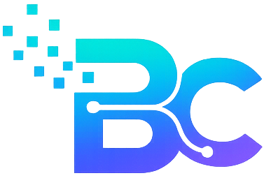

<p align="center">
  
</p>

<h1 align="center">Bitcraftly Platform</h1>

<p align="center">
  <strong>Enterprise Frontend Platform</strong><br />
  Built with Next.js 16, React 19, TypeScript, Tailwind CSS v4 & FastAPI
</p>

<p align="center">
  
  
  
  
  
</p>

---

Bitcraftly Platform is an enterprise-grade frontend platform built with **Next.js 16 (App Router)**. It follows a **feature-based architecture** and integrates seamlessly with a **FastAPI** backend to power authentication, CRM, CMS, AI services, dashboards, and future product modules.

The project is designed for **scalability, maintainability, accessibility, performance, SEO, and AI-assisted development**, making it a solid foundation for long-term enterprise applications.

# Bitcraftly Platform

Enterprise web platform for Bitcraftly — a unified frontend built with Next.js, designed to scale across product domains including authentication, CRM, CMS, AI, and dashboard experiences.

---

> [!NOTE]
> ### Project Status
>
> - 🚧 **Development Status:** Active Development
> - 📦 **Current Version:** v2
> - ⚛️ **Frontend:** Next.js 16 (App Router) + React 19
> - 🏗️ **Architecture:** Feature-Based Architecture
> - 🤖 **AI Development:** Cursor, Claude Code & ChatGPT Optimized
> - ♿ **Accessibility:** WCAG 2.2 AA Standards
> - ⚡ **Performance Target:** Lighthouse Score ≥ 95
> - 🔍 **SEO:** Technical SEO Ready
> - 🚀 **Production Status:** In Progress

---

## Project Overview

Bitcraftly Platform is the flagship frontend application for the Bitcraftly ecosystem, engineered to deliver scalable, high-performance, and maintainable web experiences.

Built with **Next.js 16 (App Router)**, **React 19**, **TypeScript**, and **FastAPI**, the platform provides a robust foundation for developing modern enterprise applications while maintaining a consistent developer experience.

Designed with a **feature-based architecture**, the project emphasizes:

- Scalable and modular application architecture
- Reusable UI components and design system
- Strict TypeScript and engineering standards
- Accessibility-first implementation (WCAG 2.2 AA)
- Performance optimization and Core Web Vitals
- Technical SEO best practices
- AI-assisted development workflows
- Long-term maintainability and extensibility

The platform is intended to support multiple product domains, including authentication, CRM, CMS, AI services, dashboards, marketing websites, and future enterprise solutions without architectural drift.

---

## Vision

Build a scalable, enterprise-grade digital platform that empowers businesses to rapidly deliver modern web applications while maintaining consistency, performance, and long-term maintainability.

Bitcraftly Platform is designed to become a unified foundation for multiple product domains, enabling independent feature development without compromising architectural integrity.

Our long-term vision is to:

- Build a scalable and future-ready platform architecture
- Deliver exceptional user experiences with performance and accessibility at the core
- Maintain a reusable design system and shared engineering standards
- Accelerate development through AI-assisted workflows and automation
- Integrate seamlessly with backend services through well-defined APIs
- Enable independent feature teams to ship with confidence
- Minimize technical debt through documentation-driven engineering
- Establish Bitcraftly as a trusted foundation for enterprise-grade digital products

---

## Tech Stack

### Frontend

| Technology | Purpose |
|------------|---------|
| Next.js 16 (App Router) | React framework and routing |
| React 19 | User interface library |
| TypeScript 5 | Type-safe development |
| Tailwind CSS v4 | Utility-first styling |
| Framer Motion | Animations and transitions |
| shadcn/ui | Reusable UI components |

---

### Backend

| Technology | Purpose |
|------------|---------|
| FastAPI | REST API framework |
| PostgreSQL | Relational database |
| JWT | Authentication and authorization |

---

### Development & Tooling

| Technology | Purpose |
|------------|---------|
| ESLint | Code quality |
| Prettier | Code formatting *(if used)* |
| Git & GitHub | Version control |
| Cursor AI | AI-assisted development |
| Claude Code | AI code assistance |
| ChatGPT | Architecture, documentation, and development support |

---

### Engineering Standards

- Feature-Based Architecture
- Server Components First
- TypeScript Strict Mode
- Accessibility (WCAG 2.2 AA)
- Technical SEO
- Performance Optimization
- AI-Assisted Development

---

## AI Development Workflow

Bitcraftly Platform is optimized for AI-assisted development. All AI tools should follow the same project workflow to ensure consistency, maintainability, and architectural integrity.

### Standard Workflow

1. Review `README.md` for project overview and development guidelines.
2. Load `AGENTS.md` to understand AI-specific instructions.
3. Read `PROJECT_CONTEXT.md` for project conventions and current context.
4. Apply only the relevant rules from `.cursor/rules/`.
5. Plan the implementation before making multi-file or architectural changes.
6. Implement the smallest safe change within the requested scope.
7. Perform a self-review using the Code Review standards.
8. Validate the implementation:

```bash
npm run lint
npm run typecheck
npm run build
```

---

### Core Rules (Always Applied)

- Engineering Standards
- Architecture Protection
- Accessibility Standards

---

### Specialized Rules (Apply When Relevant)

- Performance Standards
- SEO Standards
- Code Review Standards

---

### AI Development Principles

- Work only within the requested scope.
- Reuse existing components before creating new ones.
- Preserve the existing architecture.
- Avoid unnecessary refactoring.
- Keep changes small, safe, and production-ready.
- Explain architectural changes before implementation.

---

## Architecture

Bitcraftly Platform follows a **feature-based architecture** designed to maximize scalability, maintainability, and independent feature development.

The application uses **Next.js 16 App Router** as a thin routing layer, while business logic, UI, and services remain isolated within feature modules.

```text
                        Browser
                           │
                           ▼
              Next.js App Router (src/app/)
                 Routing, Layouts & Metadata
                           │
                           ▼
          Feature Modules (src/features/)
                           │
      ┌────────────┬────────────┬────────────┐
      ▼            ▼            ▼            ▼
 Components     Services      Hooks       Types
      │            │            │            │
      └────────────┴────────────┴────────────┘
                           │
                           ▼
                   Shared Libraries
        (lib, utils, config, providers)
                           │
                           ▼
                    FastAPI Backend
                           │
                           ▼
                       PostgreSQL
```

---

## Architecture Principles

### Server Components First

- Prefer Server Components whenever interactivity is not required.
- Use Client Components only for interactive UI.

---

### Feature-Based Architecture

Each feature owns its:

- Components
- Hooks
- Services
- Types
- Utilities

This minimizes coupling and improves maintainability.

---

### Thin Route Files

Files inside `src/app/` should contain only:

- Routing
- Metadata
- Layout composition

Business logic belongs inside `src/features/`.

---

### Shared Components

Reusable UI components belong in:

```text
src/components/
```

Business-specific components should remain inside their respective feature modules.

---

### Separation of Concerns

Each layer has a single responsibility:

| Layer | Responsibility |
|--------|----------------|
| `app/` | Routing & Layout |
| `features/` | Business Features |
| `components/` | Shared UI |
| `services/` | API Integration |
| `hooks/` | Reusable React Hooks |
| `lib/` | Framework Adapters |
| `utils/` | Pure Utility Functions |
| `types/` | Shared Type Definitions |
| `config/` | Application Configuration |

---

## Design Goals

The architecture is designed to:

- Scale without architectural drift
- Encourage code reuse
- Reduce technical debt
- Improve developer productivity
- Support AI-assisted development
- Preserve long-term maintainability

### Key principles

- **Server Components first** — Client Components only when interactivity requires them
- **Thin routes** — Pages in `src/app/` delegate to feature modules
- **Colocated features** — Each domain owns its components, hooks, services, and types
- **Shared UI in `components/ui`** — Design system primitives live outside features
- **No business logic in route files** — Keep `page.tsx` files as entry points only

See [docs/architecture/](docs/architecture/) for Architecture Decision Records and system design documents.

---

## Development Principles

Bitcraftly Platform follows a set of engineering principles to ensure consistency, maintainability, and long-term scalability.

### Core Principles

- **Server Components First** – Prefer Server Components unless client-side interactivity is required.
- **Feature-Based Architecture** – Organize code around business domains rather than technical layers.
- **Composition Over Duplication** – Reuse existing components, hooks, and services whenever possible.
- **Smallest Safe Change** – Implement only the requested changes without affecting unrelated features.
- **Accessibility by Default** – Every feature should comply with WCAG 2.2 AA standards.
- **Performance First** – Optimize rendering, bundle size, and Core Web Vitals from the beginning.
- **SEO Friendly** – Public pages should follow technical SEO best practices.
- **Strict TypeScript** – Maintain type safety and avoid using `any`.
- **Documentation-Driven Development** – Keep documentation aligned with architectural and functional changes.
- **AI-Assisted Development** – Follow the project's AI workflow and engineering rules for consistent implementation.

---

### Development Philosophy

Every contribution should aim to:

- Improve maintainability
- Preserve architectural consistency
- Minimize technical debt
- Encourage code reuse
- Keep the codebase clean, readable, and production-ready

---

## Folder Structure

The project follows a **feature-based architecture**, where business logic is organized by domain instead of technical layers.

```text
bitcraftly-platform/
├── .cursor/                    # Cursor AI configuration and rules
│   └── rules/
├── docs/                       # Project documentation
│   ├── architecture/
│   ├── design/
│   ├── engineering/
│   ├── product/
│   ├── prompts/
│   └── reviews/
├── public/                     # Static assets
├── src/
│   ├── app/                    # Next.js App Router (routes & layouts)
│   ├── components/             # Shared UI components
│   ├── config/                 # Application configuration
│   ├── data/                   # Static data
│   ├── features/               # Feature modules
│   ├── hooks/                  # Shared React hooks
│   ├── lib/                    # Framework adapters & clients
│   ├── services/               # API and external integrations
│   ├── styles/                 # Global styles
│   ├── types/                  # Shared TypeScript types
│   └── utils/                  # Utility functions
├── AGENTS.md                   # AI entry point
├── CLAUDE.md                   # Claude Code instructions
├── PROJECT_CONTEXT.md          # AI project context
├── PROJECT_FOUNDATION_REVIEW.md# Architecture review
├── README.md                   # Project documentation
├── next.config.ts
├── tsconfig.json
└── package.json
```

---

## Directory Responsibilities

| Directory | Responsibility |
|-----------|----------------|
| `src/app` | Routing, layouts, metadata |
| `src/features` | Business features and domain logic |
| `src/components` | Shared and reusable UI components |
| `src/services` | API communication and integrations |
| `src/hooks` | Shared React hooks |
| `src/lib` | Framework adapters and helper libraries |
| `src/utils` | Pure utility functions |
| `src/types` | Shared TypeScript types |
| `src/config` | Global application configuration |
| `docs` | Project documentation |
| `.cursor` | AI rules and Cursor configuration |

---

## Organization Principles

- Keep business logic inside `src/features`.
- Keep route files lightweight.
- Reuse shared components whenever possible.
- Avoid cross-feature dependencies.
- Place shared utilities outside feature modules.
- Keep documentation and AI rules up to date.

---

## Development Setup

Follow the steps below to set up the Bitcraftly Platform for local development.

---

### Prerequisites

Ensure the following tools are installed:

| Tool | Recommended Version |
|------|---------------------|
| Node.js | 20.x or later |
| npm | Latest LTS |
| Git | Latest |
| Cursor *(Optional)* | Latest |
| Claude Code *(Optional)* | Latest |

For full-stack development, ensure the FastAPI backend and PostgreSQL database are available.

---

### Clone the Repository

```bash
git clone <repository-url>
cd bitcraftly-platform
```

---

### Install Dependencies

```bash
npm install
```

---

### Configure Environment Variables

Create a local environment file:

```bash
cp .env.example .env.local
```

Update the required environment variables before starting the application.

> **Note:** Never commit `.env.local` or any secrets to version control.

---

### Start the Development Server

```bash
npm run dev
```

The application will be available at:

```
http://localhost:3000
```

---

### Verify the Setup

Run the following commands to verify the project is configured correctly:

```bash
npm run lint
npm run typecheck
npm run build
```

All commands should complete successfully before starting feature development.

---

### Recommended Development Workflow

1. Pull the latest changes.
2. Create a feature branch.
3. Implement the requested changes.
4. Run lint, typecheck, and build.
5. Commit using Conventional Commits.
6. Open a Pull Request for review.

### Optional IDE Extensions

Recommended:

- ESLint
- Prettier
- Tailwind CSS IntelliSense
- Error Lens

---

## Scripts

The following scripts are available for local development and production builds.

### Development

| Command | Description |
|---------|-------------|
| `npm run dev` | Start the Next.js development server with Turbopack |
| `npm run build` | Create an optimized production build |
| `npm run start` | Start the production server |

---

### Code Quality

| Command | Description |
|---------|-------------|
| `npm run lint` | Run ESLint across the project |
| `npm run typecheck` | Run the TypeScript compiler without emitting files |

---

### Recommended Workflow

Before pushing any changes, run:

```bash
npm run lint
npm run typecheck
npm run build
```

These commands help ensure that:

- Code quality checks pass
- TypeScript errors are resolved
- Production builds succeed
- Pull Requests are ready for review

---

### Future Scripts

The following scripts may be introduced as the project grows:

| Command | Purpose |
|---------|---------|
| `npm run test` | Run unit and integration tests |
| `npm run test:e2e` | Execute end-to-end tests |
| `npm run analyze` | Analyze bundle size |
| `npm run format` | Format source code |

---

## Quality Gates

Every contribution must satisfy the project's quality standards before it is considered ready for review or deployment.

---

### Mandatory Validation

Run the following commands before creating a Pull Request:

```bash
npm run lint
npm run typecheck
npm run build
```

All commands must complete successfully.

---

### Pull Request Checklist

Every Pull Request should verify:

- ✅ Project builds successfully
- ✅ ESLint passes without errors
- ✅ TypeScript type checking passes
- ✅ Accessibility requirements are satisfied
- ✅ Existing architecture is preserved
- ✅ Performance regressions are avoided
- ✅ SEO is preserved for public pages
- ✅ Only requested files are modified
- ✅ Documentation is updated when required

---

### Code Review Standards

Every implementation should be:

- Correct
- Readable
- Maintainable
- Type-safe
- Accessible
- Performant
- Production-ready

---

### Definition of Done

A feature is considered complete only when:

- Functional requirements are fully implemented.
- No unrelated files have been modified.
- Shared architecture remains unchanged unless explicitly approved.
- Accessibility standards are satisfied.
- Performance regressions have been avoided.
- Documentation has been updated where necessary.
- The implementation is ready for production deployment.

---
## Branch Strategy

Bitcraftly Platform follows a lightweight Git workflow designed to keep changes isolated, reviewable, and production-ready.

---

### Branch Naming Convention

| Branch | Purpose |
|--------|---------|
| `main` | Production-ready code (protected) |
| `develop` | Integration branch for upcoming releases *(optional)* |
| `feature/*` | New features (e.g. `feature/auth-login`) |
| `fix/*` | Bug fixes (e.g. `fix/navbar-overflow`) |
| `refactor/*` | Code quality improvements without changing functionality |
| `docs/*` | Documentation updates |
| `chore/*` | Tooling, dependencies, and maintenance tasks |
| `hotfix/*` | Critical production fixes |

---

### Recommended Workflow

1. Pull the latest changes from `main`.
2. Create a dedicated feature branch.
3. Keep commits focused and atomic.
4. Follow Conventional Commits.
5. Run all Quality Gates before pushing.
6. Open a Pull Request for review.
7. Merge only after approval and successful validation.

---

### Best Practices

- One feature per branch.
- One feature per Pull Request.
- Avoid mixing unrelated changes.
- Keep Pull Requests small and easy to review.
- Rebase or merge regularly to minimize conflicts.
- Delete merged branches to keep the repository clean.

---

### Protected Branch Rules

The `main` branch should remain protected.

Direct commits to `main` should be avoided.

All production changes should be merged through a reviewed Pull Request.

---

### Workflow

1. Branch from `main` (or `develop` if using Git Flow)
2. Keep changes focused and small
3. Open a pull request with a clear description
4. Ensure `lint`, `typecheck`, and `build` pass before merge
5. Squash or merge according to team preference

---

## Conventional Commits

Bitcraftly Platform follows the **Conventional Commits** specification to maintain a clear, searchable, and automated commit history.

Reference: <https://www.conventionalcommits.org/>

---

### Commit Format

```text
<type>(<optional scope>): <description>
```

Example:

```text
feat(auth): add login form validation
fix(routing): resolve App Router redirect issue
docs(readme): improve project documentation
refactor(homepage): simplify hero component
```

---

### Commit Types

| Type | Purpose |
|------|---------|
| `feat` | Introduce a new feature |
| `fix` | Resolve a bug |
| `refactor` | Improve code without changing behavior |
| `docs` | Documentation changes |
| `style` | Formatting and style changes only |
| `test` | Add or update tests |
| `perf` | Performance improvements |
| `build` | Build system or dependency updates |
| `ci` | Continuous Integration changes |
| `chore` | Maintenance and tooling tasks |

---

### Best Practices

- Write commit messages in the imperative mood.
- Keep the subject concise and descriptive.
- Reference the affected feature when appropriate.
- Avoid mixing unrelated changes in a single commit.
- Prefer multiple small commits over one large commit.

---

### Examples

```text
feat(ai): add AI assistant landing page

fix(navbar): prevent mobile menu overflow

refactor(button): extract reusable loading state

docs(project): update development workflow

perf(images): optimize hero banner loading

chore(deps): update project dependencies
```

---

### Commit Guidelines

Every commit should:

- Represent a single logical change.
- Pass all Quality Gates.
- Keep the repository history clean.
- Be easy to understand during future maintenance.

---

## Product Roadmap

The roadmap outlines the planned evolution of the Bitcraftly Platform. Priorities may evolve based on business requirements and customer feedback.

| Phase | Status | Focus |
|-------|--------|-------|
| **Phase 1 – Foundation** | ✅ Completed | Next.js App Router, project architecture, documentation, AI rules, engineering standards |
| **Phase 2 – Design System** | 🚧 In Progress | Design tokens, reusable UI components, layouts, animations |
| **Phase 3 – Authentication** | ⏳ Planned | JWT authentication, protected routes, session management |
| **Phase 4 – Core Platform** | ⏳ Planned | Homepage, navigation, dashboard shell, global layouts |
| **Phase 5 – Business Modules** | ⏳ Planned | CRM, CMS, AI services, portfolio, case studies |
| **Phase 6 – Production Readiness** | ⏳ Planned | Monitoring, analytics, security hardening, CI/CD, deployment |

---

### Future Enhancements

Potential future capabilities include:

- AI-powered website assistant
- AI workflow automation
- Advanced analytics dashboard
- Multi-language support (i18n)
- Role-based access control (RBAC)
- CMS integration
- Real-time notifications
- Payment and subscription management
- API developer portal
- Microfrontend architecture (if required)

---

### Guiding Principles

The roadmap prioritizes:

- Long-term maintainability
- Scalable architecture
- Performance and accessibility
- Documentation-driven development
- AI-assisted engineering
- Incremental and low-risk delivery

---

## Documentation Map

| Resource | Description |
|----------|-------------|
| 📘 `README.md` | Project overview and onboarding guide |
| 🤖 `AGENTS.md` | Primary AI agent instructions |
| 🧠 `PROJECT_CONTEXT.md` | AI project context and conventions |
| 🏗️ `PROJECT_FOUNDATION_REVIEW.md` | Architecture review and technical foundation |
| 💬 `CLAUDE.md` | Claude Code entry point |
| ⚙️ `.cursor/rules/` | AI engineering and development standards | 

---

## Documentation

The project documentation is organized to support onboarding, development, architecture, and AI-assisted workflows.

---

### Documentation Map

| Resource | Purpose |
|----------|---------|
| `README.md` | Project overview, setup, architecture, and development guide |
| `AGENTS.md` | Primary AI agent instructions and workflow |
| `CLAUDE.md` | Claude Code entry point and AI guidance |
| `PROJECT_CONTEXT.md` | AI project context, conventions, and development priorities |
| `PROJECT_FOUNDATION_REVIEW.md` | Architecture review, technical decisions, and project foundation |
| `.cursor/rules/` | Engineering, architecture, accessibility, performance, SEO, and code review standards |
| `docs/architecture/` | Architecture Decision Records (ADRs) and system design |
| `docs/design/` | Design system, UI guidelines, and design tokens |
| `docs/engineering/` | Engineering standards, coding guidelines, and workflows |
| `docs/product/` | Product requirements and specifications |
| `docs/prompts/` | AI prompt library and reusable prompts |
| `docs/reviews/` | Technical reviews, audits, and assessment reports |

---

### Documentation Principles

All project documentation should be:

- Accurate and up to date
- Version controlled
- Easy to navigate
- Written in clear, concise language
- Updated alongside relevant code changes

---

### When to Update Documentation

Update documentation whenever you:

- Introduce a new feature
- Change the architecture
- Modify the development workflow
- Add or remove project dependencies
- Introduce new AI rules or standards
- Update setup or deployment instructions

Documentation is considered part of the implementation—not an afterthought.

---

## Security

Bitcraftly Platform follows security best practices throughout the development lifecycle. Every contribution should protect application integrity, user data, and sensitive configuration.

---

### Security Principles

- Never commit secrets, API keys, or credentials.
- Store sensitive configuration in environment variables.
- Follow JWT authentication and authorization best practices.
- Validate and sanitize all external input.
- Use HTTPS for all production deployments.
- Apply the Principle of Least Privilege (PoLP).
- Keep project dependencies up to date.
- Report security vulnerabilities responsibly.

---

### Environment Variables

Sensitive values should be stored in local environment files such as:

```text
.env.local
.env.development
.env.production
```

These files must never be committed to version control.

---

### Authentication

Authentication should:

- Use JWT-based authentication.
- Protect private routes.
- Validate user permissions on both client and server.
- Never expose sensitive tokens in source code.

---

### Dependency Management

Regularly:

- Update dependencies.
- Review security advisories.
- Remove unused packages.
- Monitor for known vulnerabilities.

---

### Future Enhancements

As the platform evolves, additional security features may include:

- Role-Based Access Control (RBAC)
- Multi-Factor Authentication (MFA)
- Rate Limiting
- Audit Logging
- Security Headers
- Content Security Policy (CSP)

---

## AI Rules Summary

Bitcraftly Platform is optimized for AI-assisted development. All AI tools should follow the same engineering standards and project conventions to ensure consistent, maintainable, and production-ready implementations.

---

### Rule Hierarchy

| Category | Applies | Purpose |
|----------|---------|---------|
| **Engineering Standards** | ✅ Always | Coding standards, TypeScript, React, project conventions |
| **Architecture Protection** | ✅ Always | Preserve architecture and protect frozen pages |
| **Accessibility Standards** | ✅ Always | WCAG 2.2 AA compliance and semantic HTML |
| **Performance Standards** | 🎯 When Relevant | Core Web Vitals, rendering, bundle optimization |
| **SEO Standards** | 🎯 When Relevant | Metadata, structured data, crawlability |
| **Code Review Standards** | 🎯 Before Completion | Self-review, quality assurance, production readiness |

---

### Standard AI Workflow

```text
README.md
      ↓
AGENTS.md
      ↓
PROJECT_CONTEXT.md
      ↓
Relevant .cursor/rules
      ↓
Implementation
      ↓
Self Review
      ↓
Validation
```

---

### AI Development Principles

Every AI-generated implementation should:

- Respect the requested scope.
- Preserve the existing architecture.
- Prefer reusable components over duplication.
- Implement the smallest safe change.
- Avoid modifying unrelated files.
- Maintain strict TypeScript.
- Preserve accessibility and performance.
- Produce production-ready code.

---

### Final Validation

Before considering any task complete:

```bash
npm run lint
npm run typecheck
npm run build
```

If any validation fails, the implementation should be corrected before submission.

---

## License

Private — All rights reserved.
